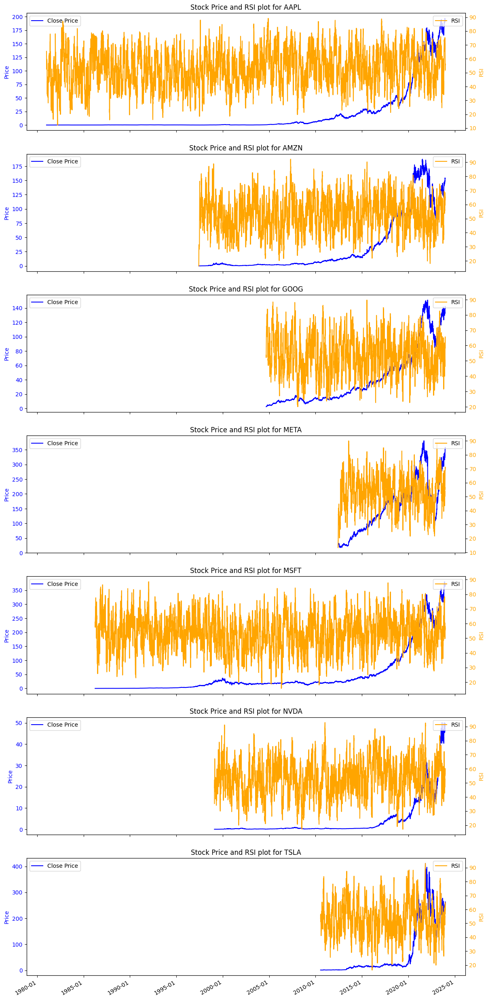

# Financial News Sentiment and Stock Market Movements

## Project Overview

This project explores the relationship between financial news sentiment and stock market movements. This project is make me skilled in Data Engineering (DE), Financial Analytics (FA), and Machine Learning Engineering (MLE). It analyzes financial news headlines and their correlation with stock price data for seven major companies:

1. Apple (AAPL)
2. Amazon (AMZN)
3. Google (GOOG)
4. Meta (META)
5. Microsoft (MSFT)
6. Nvidia (NVDA)
7. Tesla (TSLA)

The goal is to understand how news sentiment influences stock prices and to develop predictive models that can inform investment strategies.

## Core Objectives and Project Goals

### Objectives

1. **Analyze financial news sentiment** and its impact on stock market movements.
2. **Identify correlations** between news sentiment and stock price changes.
3. **Develop insights** into how news sentiment can be used to predict stock price trends.

### Goals

- Provide a detailed understanding of sentiment trends and their effect on stock prices.
- Offer actionable insights for investors and financial analysts based on sentiment analysis.

## Implementation Process

### 1. Data Collection

- **Financial News Data**: Collected headlines and associated metadata from reliable sources.
- **Stock Price Data**: Gathered historical stock prices for the selected companies from financial databases.

### 2. Exploratory Data Analysis (EDA)

- **Financial News Dataset**:
  - Performed descriptive analysis to understand the dataset's structure.
  - Applied sentiment analysis to headlines to determine the overall tone.
- **Stock Price Dataset**:
  - Analyzed historical stock prices to identify trends, volatility, and technical indicators.
  - Calculated technical indicators like Moving Averages and RSI, EMA, MACD.
    - SMA(moving avarage):- calculated by taking the average of a set number of closing prices over a specific period. Window Size: The window size determines how many data points are used in the average. A larger window size smooths out fluctuations but reacts slower to price changes. here are the visualization for the 7 company SMA with the insight.
      
    - RSI:- is a momentum oscillator that measures the speed and change of price movements. It is typically used to identify overbought or oversold conditions in a market. the strength of price movements. Values above 70 suggest an overbought condition, while below 30 suggests oversold conditions.
    - EMA:- EMA is a type of moving average that gives more weight to the most recent prices, making it more responsive to price changes than a simple moving average.
    - MACD:- MACD is a trend-following momentum indicator that shows the relationship between two moving averages of a security’s price.

### 3. Visualization

- **Financial News Dataset**: Created visualizations to display sentiment distribution and trends over time.
- **Stock Price Dataset**: Developed charts to illustrate stock price trends, volatility, and technical indicators.

### 4. Ongoing and Future Work

- **Ongoing**: Integration of sentiment analysis results with stock price data for correlation analysis.
- **Future**: Development and validation of predictive models based on sentiment data and stock price trends.

## Methods and Tools Used

- **Programming Language**: Python
- **Libraries**:
  - **Data Manipulation**: Pandas, Numpy
  - **Sentiment Analysis**: NLTK, TextBlob
  - **Visualization**: Matplotlib, Seaborn
  - **Technical Indicators**: Custom Python functions
- **Development Environment**: Jupyter Notebooks

## Project Structure

data/ # Contains raw datasets (financial news and stock prices)
notebooks/ # Jupyter Notebooks used for data analysis and visualization ontains the final report, including visualizations and findings
src/ # Python scripts for data processing, analysis, and visualization
README.md # Overview of the project, including core objectives, implementation details, and project structure

## Usage

### Clone the Repository

To clone the repository, run:

```bash
git clone https://github.com/Marta233/Stock_Price_Analysis.git
cd Stock_Price_Analysis

Install Dependencies
Install the required dependencies using:
pip install -r requirements.txt

Run Notebooks
Open the notebooks in your preferred environment to explore the analysis and visualize results.

Contributing
Contributions are welcome! Please feel free to submit a pull request or open an issue for any suggestions or improvements.
```
